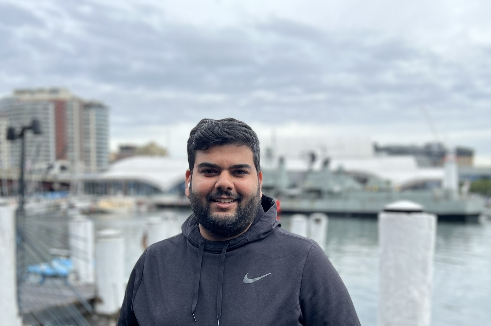

## About Me

<!-- {: class="profile-picture"} -->

Hi! I am a PhD Student at Boston University and member of the
<a href="https://disc.bu.edu">DiSC Lab</a>, advised by <a href="https://cs-people.bu.edu/mathan/">Prof. Manos Athanassoulis</a>.

#### Email: aneeshr@bu.edu

#### Office: 925C, Center for Computing and Data Sciences, BU

---

## Research Interests

My research focus is on Database systems - indexing and access methods. I have primarily been working on building sortedness-aware indexes for data systems.

---

## Recent Updates

<!-- This is a [link](https://google.com). Something *italics* and something **bold**.

Here is a table -->

| Date      | News                                                                                                            |
| --------- | --------------------------------------------------------------------------------------------------------------- |
| May, 2023 | Interning at SystemsResearch@Google for the summer                                                              |
| Apr, 2023 | Presented work on "Indexing for Near-Sorted Data" @ IEEE ICDE                                                   |
| Sep, 2022 | Presented work on "BoDS: A Benchmark on Data Sortedness" @ TPCTC 2022                                           |
| Jun, 2022 | Recognized with the Outstanding Teaching Fellow Award by Graduate  School of Arts and Sciences, Boston Univ. |

<!-- Here is a horizontal rule

--- -->

<!-- Here is a blockquote

> To a great mind, nothing is little

## References

* Foo Bar: Head of Department, Placeholder Names, Lorem
* John Doe: Associate Professor, Department of Computer Science, Ipsum -->

---

## Publications

<!-- 1. F.Bar, J.Doe: Effects of having a placeholder of a name
2. S.Holmes, J.Watson: Consequences of living with a sociopath in London -->

1. A.Raman, S.Sarkar, M.Olma, M.Athanassoulis. **Indexing for Near-Sorted Data**, _Proceedings of the International Conference on Data Engineering (ICDE), 2023_
2. A.Raman, K.Karatsenidis, S.Sarkar, M.Olma, M.Athanassoulis. **BoDS: A Benchmark on Data Sortedness**, _Proceedings of the TPC Technology Conference on Performance Evaluation and Benchmarking (TPCTC), 2022._
3. Ju Hyoung Mun, Zichen Zhu, Aneesh Raman, Manos Athanassoulis. **LSM-Tree Under (Memory) Pressure**, _Proceedings of the International Workshop on Accelerating Data Management Systems Using Modern Processor & Storage Architectures, 2022._
4. Zichen Zhu, Ju Hyoung Mun, Aneesh Raman, Manos Athanassoulis. **Reducing Bloom Filter CPU Overhead in LSM-Trees on Modern Storage Devices**, _Proceedings of the International Workshop on Data Management on New Hardware (DaMoN), 2021._
5. Jin Soung Yoo, Sang Jun Park, Aneesh Raman. **Micro-level Incident Analysis Using Spatial Association Rule Mining**, _IEEE International Conference on Big Knowledge (ICBK), 2019_

---

<!-- <a href="mailto:aneeshr@bu.edu" title="email"><i class="fas fa-envelope"></i></a> -->
