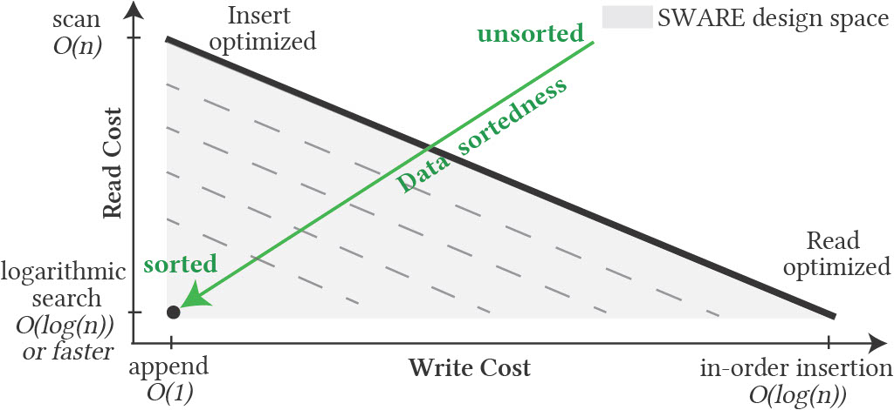
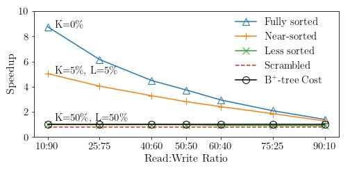
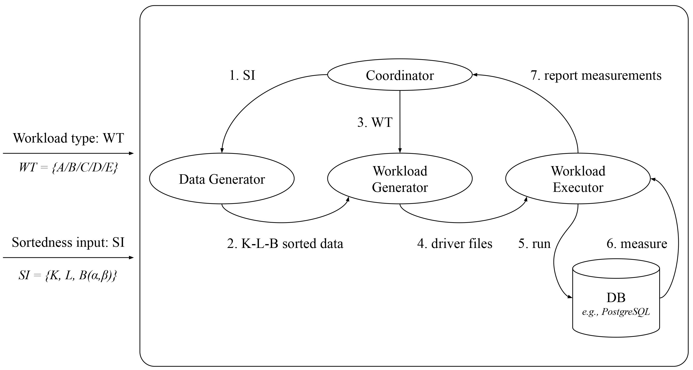
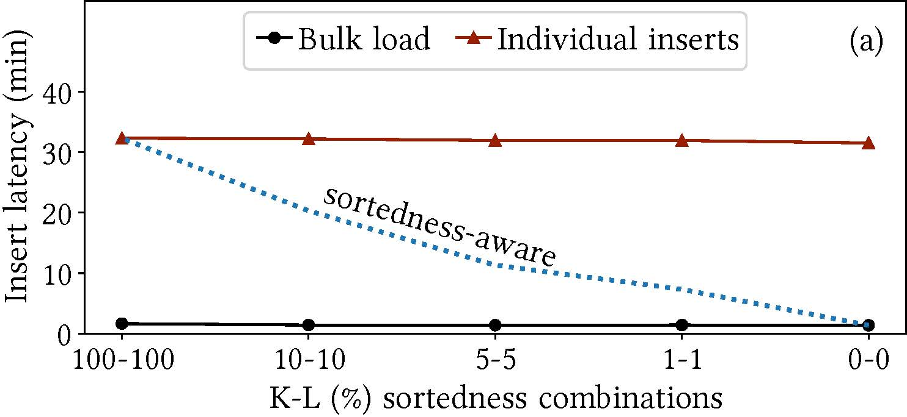

# Current Projects #

## Sortedness-Aware Indexing ##
{: style="width:48%"}
{: style="width:50%"}

Indexing in data systems can be perceived as the process of adding structure to the incoming, otherwise unsorted data. If the data
ingestion order matches the indexed attribute order, the indexing effort is redundant and can be avoided altogether.
We identify sortedness as a resource that can accelerate index ingestion, and propose a new design paradigm that pays less indexing
cost for near-sorted data. 

[Local PDF](https://cs-people.bu.edu/mathan/publications/icde23-raman.pdf) |
[Source Code](https://github.com/BU-DiSC/sware) 

---
## BoDS: A Benchmark on Data Sortedness ## 

{: style="width:48%"}
{: style="width:48%"}

Data systems and underlying indexes offer favorable ingestion (and
query) performance for only the two extremes of data sortedness - unsorted
data or fully sorted data. In practice, data may arrive with intermediate
sortedness and the intuition is that index construction should be cheaper. 
However, there is a need for a framework to
explore how index designs may be able to exploit pre-existing sortedness
during data ingestion.
BoDS highlights the performance of data systems in terms of index
construction and navigation costs when operating on data ingested with variable sortedness.

[Local PDF](https://cs-people.bu.edu/mathan/publications/tpctc22-raman.pdf) |
[Source Code](https://github.com/BU-DiSC/bods) | 
[Presentation Video](https://www.youtube.com/watch?v=sb6jw0zz-CU)

---